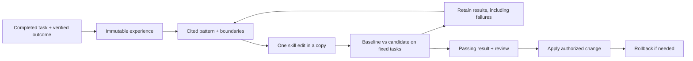

# Learning and skill evolution

LLM Wiki can preserve what happened during a task and use that evidence to improve a procedure. The workflow is optional: ordinary source ingestion, questions and search work as before.



## Learn from completed work

```text
/wiki:learn <task artifacts or experience record>
```

In other agents, say “learn from this completed task and save the reusable lesson.” The agent reads the actual actions and verification artifacts, captures immutable JSON under your raw root, ingests a source page, and consolidates a concept pattern. Both successes and failures are useful. It keeps hypotheses, evidence, applicability, model/tool versions and counterexamples distinct. It updates existing patterns rather than creating one rule per incident.

This does not change a skill or launch paid inference. It uses ordinary source, concept and synthesis pages, so existing search and graph navigation still work. The agent updates the normal index and log.

## Improve a procedure

```text
/wiki:evolve Improve the query workflow using the superseded-decision failures
/wiki:evolve history
/wiki:evolve show query-supersession-01
/wiki:evolve apply query-supersession-01
/wiki:evolve rollback query-supersession-01
```

The agent inspects previous attempts, stages a small edit to one existing file within a skill, and records its evidence and rationale. Evaluation runs complete baseline and candidate skill snapshots against fresh copies of the same wiki corpus. The live skill stays unchanged during testing. Only an authorized `apply` installs a passing, reviewed candidate. Rejected experiments retain their evidence, diffs and results.

Use a working copy of a skill while developing improvements. Multi-file changes should be decomposed into independently testable proposals. A proposal is not a plugin release, and applying it does not publish or update other installations.

## Direct CLI

All paths below are examples. Replace `<skill-root>` with the installed LLM Wiki skill directory, independently of your wiki root and target skill.

```bash
python <skill-root>/scripts/wiki_evolve.py capture \
  --raw /path/to/raw --record /path/to/experience.json

python <skill-root>/scripts/wiki_evolve.py --wiki /path/to/wiki propose \
  --id query-supersession-01 --skill /path/to/working-skill \
  --target references/query-workflow.md --candidate /path/to/candidate.md \
  --evidence concepts/superseded-decisions.md \
  --reason "Resolve explicit superseding decisions before answering current questions"

python <skill-root>/scripts/wiki_evolve.py --wiki /path/to/wiki evaluate query-supersession-01 \
  --suite <skill-root>/assets/evolution/suite.json --runner /path/to/runner.json \
  --model <exact-model-id> --tools "agent version; tool versions" --repeats 3 --timeout 120

python <skill-root>/scripts/wiki_evolve.py --wiki /path/to/wiki apply query-supersession-01
python <skill-root>/scripts/wiki_evolve.py --wiki /path/to/wiki rollback query-supersession-01
```

The CLI emits JSON. `--wiki` goes before the subcommand. Capture requires an existing raw root, not necessarily a sibling of the wiki. The raw record template is installed as `.experience-template.json`; new concept patterns can start from `.pattern-template.md`.

## Runner and evaluation contract

A runner is a trusted executable described by an argv array in runner.json. It receives one JSON request on stdin with `version`, `question`, `skill_root`, `wiki_root`, `model` and `tools`. Expected answers, task IDs, split and variant labels are omitted. It must use the supplied skill and factual wiki, avoid unrelated skills/history, and emit:

```json
{"answer":"The current trial is 30 days.","abstain":false,"citations":["sources/pricing-current.md"],"tool_calls":3,"cost":0.02}
```

Measure actual tool calls and inference cost; don't estimate missing values as zero. Citations are exact wiki-relative file paths. Stdout contains JSON only; diagnostics belong on stderr. Copies isolate normal work but are not an OS sandbox for an untrusted runner. Model and tool versions should identify the actual execution setup.

An optional Claude Code adapter ships in `scripts/wiki_evolve_claude.py`. Configure it with:

```json
["python3", "/absolute/installed-skill/scripts/wiki_evolve_claude.py"]
```

It requires an installed, authenticated CLI supporting restricted mode, structured output and stream JSON. It uses Read/Grep/Glob only, disables ambient skills/MCP, and measures cost in USD from CLI results. It evaluates document navigation rather than shell-based hybrid search. Inference uses your Claude account and sends the supplied task context to the model; the local-search privacy guarantee does not make an external agent runner local. Other agents/models can implement the same small stdin/stdout contract.

The bundled suite has 20 fictional tasks: 12 validation and 8 held-out cases, covering facts, current versus historical decisions, multiple sources, contradictions and abstention. It is a public starter regression suite. Use separate development examples and fresh held-out questions for real optimization. Once held-out failures inform a new proposal, replace that holdout set.

The harness repeats each task for both variants and alternates execution order between repeats. Three repeats across 20 tasks means 120 runner invocations; authorize that cost before starting. Timeouts, malformed outputs, edited input snapshots or runner failures block promotion. One evaluation is recorded per proposal.

The gate requires:

- Strict improvement in validation pass count.
- No baseline-passing task/repeat becoming a failure in either split.
- Held-out pass count at least as high as baseline.
- Total cost and tool calls within the suite's limits, defaulting to 1.25 times baseline. Zero baseline usage permits only zero candidate usage.

Each case checks required/forbidden phrases, expected citation paths and abstention. These are deterministic rubric checks, not semantic entailment judgments or statistical significance tests. Review answers and calibrate rubrics before interpreting the scores. The existing retrieval evaluation remains a separate check of search quality. No model performance improvement is claimed by shipping this harness.

## Storage and recovery

`wiki/.evolution/<experiment-id>/` contains full baseline/candidate snapshots, proposal evidence, the diff, evaluation records and transition receipts. Back this archive up; it is not disposable like `.wiki-cache/`. Search, lint, stats and graph tools exclude it. Searchable lessons and summaries stay in normal wiki pages. Private artifacts should not be committed into public plugin releases.

Apply and rollback verify the whole selected skill before replacing its target file, refusing concurrent edits. Do not edit that skill while a transition runs. To recover after interruption, rerun the same apply/rollback command. If a dead process left `.evolution/lock/`, confirm it is no longer running before removing that empty directory. Do not edit snapshots or measurements to bypass a failed gate.

See the complete agent procedure in [evolution-workflow.md](https://github.com/praneybehl/llm-wiki-plugin/blob/main/skills/llm-wiki/references/evolution-workflow.md). The design adapts ideas from [WikiSkill](https://arxiv.org/html/2608.27454v1), without reproducing its autonomous optimizer or claiming its benchmark gains.

Apply/rollback also use a temporary `.wiki-evolve-lock/` in the target skill to coordinate changes from different wikis. After a process dies, inspect both this lock and the wiki lock before removing stale empty lock directories and retrying. This lock directory is excluded from skill snapshots.
