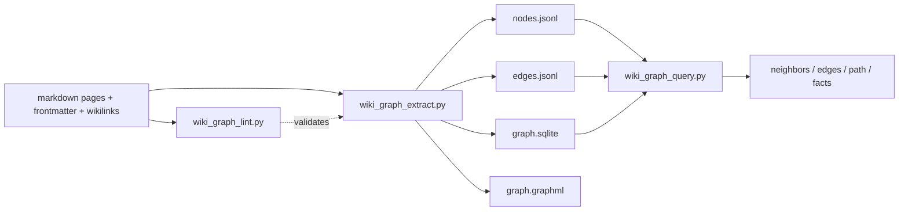

<!-- Adapted from: docs/graph.html (source: skills/llm-wiki/references/graph-workflow.md). -->

# Graph layer

The graph is an optional compiled index over the markdown wiki. It makes typed, provenance-backed relationships machine-queryable while keeping markdown canonical — and it can be rebuilt from the pages at any time.

::: info
The graph is opt-in. If `wiki/graph/ontology.yaml` is absent, the wiki is pre-graph: don't run extract / lint / query and don't fabricate ontology files. Seed the layer first (via [`/wiki:graph`](/commands#graph) or [`/wiki:init`](/commands#init)) or proceed without it.
:::

Markdown pages are canonical; every artifact below is generated and can be deleted and rebuilt at any time.



## What the graph captures

Three classes of edge come out of an extract:

1. **Typed semantic edges** declared in a page's `graph.relationships[]` frontmatter (e.g. `founded`, `proposed`, `depends_on`). Each carries an explicit `source` (a source-page slug), an `evidence` quote, a `confidence` (high/medium/low), and a `status` (current/historical/proposed/disputed/superseded). The extractor never invents these.
2. **`mentions` edges** — one per body `[[wikilink]]`, deduplicated per page, confidence `low`. They accelerate navigation but are not evidence of a typed relationship.
3. **`sourced_from` and `summarizes_raw` edges** — from a non-source page's `sources:` list to the source page, and from a source page's `raw:` field to the raw file.

## Frontmatter schema

Typed relationships live in a page's frontmatter:

```yaml
graph:
  node_id: person:praney-behl       # optional; default <node_type>:<slug>
  node_type: person                 # optional; default mapped via ontology
  canonical: true                   # when multiple slugs alias one entity
  aliases: [Praney, praney@example.com]
  relationships:
    - predicate: founded
      object: company:seedblocks
      source: praney-founder-context-dump
      evidence: "Solo technical founder and sole director..."
      confidence: high
      status: current
```

Required relationship fields: `predicate`, `object`, `source`, `evidence`, `confidence`, `status`. A `node_id` is `<node_type>:<slug>`.

## The ontology

`wiki/graph/ontology.yaml` is the contract. It declares `node_types[*].maps_from` (how a page's `type`/`kind` projects onto a node type) and `predicates[*]` (allowed predicates with their `subject_types`, `object_types`, and `requires_evidence`; `"*"` is a wildcard). Edit the ontology to add a domain predicate, then re-run lint to validate existing edges against it.

## Typed edge vs plain wikilink

Add a **typed edge** when a specific source explicitly states the relationship, you can quote evidence, and the predicate is meaningful for downstream queries. Use a plain **`[[wikilink]]`** when the relationship is implicit, you can't pin it to a single quote, or it would just be a `mentions` edge. When in doubt, write the wikilink — lint surfaces missing evidence; it does not punish under-claiming.

## Extract, lint, query

```bash
# Validate typed metadata first; lint never edits.
python skills/llm-wiki/scripts/wiki_graph_lint.py wiki/

# Compile to nodes.jsonl, edges.jsonl, graph.sqlite, graph.graphml.
python skills/llm-wiki/scripts/wiki_graph_extract.py wiki/

# Navigate.
python skills/llm-wiki/scripts/wiki_graph_query.py wiki/ neighbors --node product:konvy
python skills/llm-wiki/scripts/wiki_graph_query.py wiki/ edges    --subject person:stephanie-emmanouel
python skills/llm-wiki/scripts/wiki_graph_query.py wiki/ path     --from person:praney-behl --to product:konvy
python skills/llm-wiki/scripts/wiki_graph_query.py wiki/ facts    --about product:konvy
```

`--json` works on both lint and query commands. The same operations are available via the [`/wiki:graph`](/commands#graph) slash command. Always cite the wiki page and its raw source in answers — the graph tells you which page to read; it is not itself the evidence.

## Generated artifact policy

| File | Canonical? | Default tracking |
| --- | --- | --- |
| `ontology.yaml` | Yes — edit by hand | Tracked |
| `nodes.jsonl` | Generated | Optional — track for graph diffs in PRs |
| `edges.jsonl` | Generated | Optional — same as above |
| `graph.sqlite` | Generated | Gitignored by default (large, binary) |
| `graph.graphml` | Generated | Gitignored by default |

::: info
The graph scripts (`wiki_graph_extract.py`, `wiki_graph_lint.py`, `wiki_graph_query.py`) require PyYAML: `pip install pyyaml`. The four core scripts (init, search, lint, stats) remain stdlib-only.
:::
