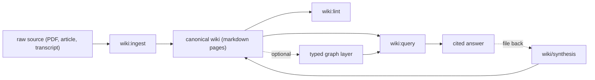

<!-- Adapted from: docs/index.html (source: README.md "What is this?", "Why use it", "Quick start"). -->

# LLM Wiki

Build and maintain an LLM-curated personal knowledge base in your project — an implementation of [Andrej Karpathy's LLM Wiki pattern](https://gist.github.com/karpathy/442a6bf555914893e9891c11519de94f), designed to scale to thousands of pages without becoming a context bottleneck.

Most ways of using LLMs with documents look like RAG: you upload files, the model retrieves chunks at query time, generates an answer, and nothing accumulates. Every question re-derives knowledge from raw fragments. The LLM Wiki pattern flips this — when a new source arrives, the model compiles it *once* into a persistent, structured wiki of markdown pages, and later queries read the pre-synthesized wiki rather than the raw sources. Knowledge compounds.

The maintenance burden is what kills personal wikis: updating cross-references, keeping summaries current, noting when new data contradicts old claims. LLMs don't get bored, don't forget a backlink, and can touch fifteen files in one pass. The wiki stays alive because the cost of maintenance drops to near zero.

::: tip New in v2.0.0
Section-level search with `--json` evidence rows, a functional incremental `--cache`, opt-in hybrid embeddings, a retrieval eval harness, and this documentation site. See [Search & retrieval](/search) and [Upgrade to v2](/upgrade).
:::

## How it works

Compile each source once, then read the pre-synthesized wiki for every later question. Knowledge accumulates in canonical markdown; the optional graph layer is rebuilt from those same pages.



## Three steps to a working wiki

1. **Initialize** the structure in your project.

   ```bash
   /wiki:init
   ```

2. **Ingest** your first source — a PDF, an article, a transcript.

   ```bash
   /wiki:ingest raw/your-source.pdf
   ```

3. **Query** the accumulated knowledge, with citations.

   ```bash
   /wiki:query What does my wiki say about X?
   ```

Not a Claude Code user? The same skill runs in Codex, Cursor, Pi, OMP, and more — see [Getting started](/getting-started) and the [agent support matrix](/agents).

## Explore the docs

- **[Getting started](/getting-started)** — Install for your agent, then walk through init, ingest, query, and lint.
- **[Commands](/commands)** — Every `/wiki:*` slash command with usage and examples.
- **[Workflows](/workflows)** — Step-by-step ingest, query, and lint walkthroughs for end users.
- **[Search & retrieval](/search)** — Section-level BM25, JSON evidence, the cache, and optional embeddings.
- **[Graph layer](/graph)** — The optional compiled graph for typed, provenance-backed relationships.
- **[Integrations](/integrations)** — The Paperclip plugin that surfaces the wiki inside a team UI.
- **[Agents](/agents)** — Which coding agents are supported and how to install for each.
- **[Upgrade to v2](/upgrade)** — Idempotent upgrade for existing wikis — no content migration.

## Frequently asked questions

### What is an LLM Wiki?

An LLM Wiki is a persistent, agent-maintained knowledge base compiled from project sources into structured Markdown pages. Instead of re-reading raw documents for every question, the agent ingests each source once, maintains links and summaries over time, and answers later questions from the accumulated wiki.

### How is an LLM Wiki different from RAG?

RAG retrieves chunks from raw documents at query time, so each question reconstructs context from fragments. An LLM Wiki compiles sources into canonical pages during ingestion. Retrieval then searches the already-synthesized knowledge, letting corrections, cross-links, provenance, and contradictions compound across sessions.

### Does LLM Wiki require embeddings or a vector database?

No. The default retrieval path is dependency-free section-level BM25 with an incremental local cache. Embeddings are optional and can be fused with lexical results through reciprocal rank fusion. The typed graph is also optional, while canonical Markdown remains the source of truth.

### Which coding agents support LLM Wiki?

The agentskills.io-compatible skill is verified with Claude Code, Codex, Cursor, Gemini CLI, OpenCode, OpenClaw, Pi, and OMP. Claude Code also receives `/wiki:*` slash commands through the plugin; other agents invoke the same workflows through natural language. See the [agent support matrix](/agents).

### How do I install and start using LLM Wiki?

Install the plugin or skill for your agent, run `/wiki:init`, ingest a source with `/wiki:ingest`, then ask a cited question with `/wiki:query`. Run `/wiki:lint` periodically to catch structural and semantic issues. The [getting-started guide](/getting-started) lists exact commands for every supported agent.

---

LLM Wiki plugin — MIT licensed. [Source on GitHub](https://github.com/praneybehl/llm-wiki-plugin). Based on [Karpathy's LLM Wiki gist](https://gist.github.com/karpathy/442a6bf555914893e9891c11519de94f).
