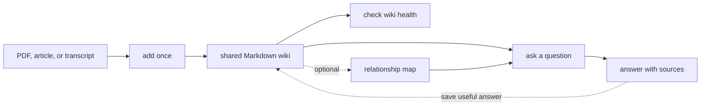

<!-- Adapted from: docs/index.html (source: README.md "What is this?", "Why use it", "Quick start"). -->

# LLM Wiki

Turn PDFs, articles, transcripts, and notes into a shared wiki that your AI agents can search, cite, and keep up to date.

AI agents are good at the task in front of them, but a new session starts with limited context. LLM Wiki gives them a shared memory that lives inside your project.

Add a source once. The agent turns it into linked Markdown pages. Later, it can find the right section, answer with citations, and save useful learning back into the wiki.

Everything stays in readable Markdown. You do not need a vector database or an embedding service to get started.

## Why this exists

AI agents can do good work in one session. The problem is what happens after the chat ends.

A useful answer may be buried in last week's conversation. A decision may live in a meeting transcript. A correction may sit in an issue. When that context is scattered, the next agent has to find the same files and rebuild the same understanding.

LLM Wiki gives that work somewhere durable to go. Sources become linked Markdown, answers keep their citations, and useful conclusions can be saved for the next session or the next agent.

Use it when knowledge should outlive one conversation: long-running research, customer calls, project decisions, recurring questions, and work shared across agents. For one-off questions or structured records, a chat or regular database may be the better tool.


*Add sources once, retrieve cited evidence later, and save useful learning back so the next session starts with more than the last one did.*

::: tip New in v2.0.0
Search is now more precise, repeat searches are faster, and meaning-based search is optional. See [Search & retrieval](/search) and [Upgrade to v2](/upgrade).
:::

## How it works

Add each source once. Later questions use the shared wiki instead of starting from the raw files again.



## Three steps to a working wiki

1. **Initialize** the structure in your project.

   ```bash
   /wiki:init
   ```

2. **Ingest** your first source — a PDF, an article, a transcript.

   ```bash
   /wiki:ingest raw/your-source.pdf
   ```

3. **Query** the accumulated knowledge, with citations.

   ```bash
   /wiki:query What does my wiki say about X?
   ```

Not a Claude Code user? The same skill runs in Codex, Cursor, Pi, OMP, and more — see [Getting started](/getting-started) and the [agent support matrix](/agents).

## Explore the docs

- **[Getting started](/getting-started)** — Install for your agent, then walk through init, ingest, query, and lint.
- **[Commands](/commands)** — Every `/wiki:*` slash command with usage and examples.
- **[Workflows](/workflows)** — Step-by-step ingest, query, and lint walkthroughs for end users.
- **[Search & retrieval](/search)** — Section-level BM25, JSON evidence, the cache, and optional embeddings.
- **[Graph layer](/graph)** — The optional compiled graph for typed, provenance-backed relationships.
- **[Integrations](/integrations)** — The Paperclip plugin that surfaces the wiki inside a team UI.
- **[Agents](/agents)** — Which coding agents are supported and how to install for each.
- **[Upgrade to v2](/upgrade)** — Idempotent upgrade for existing wikis — no content migration.

## Frequently asked questions

### What is an LLM Wiki?

LLM Wiki is a shared knowledge base for AI agents. It turns your sources into linked Markdown pages, keeps them organized, and answers later questions with citations.

### How is LLM Wiki different from RAG?

RAG usually searches raw document chunks each time you ask a question. LLM Wiki organizes each source into useful pages first. Later questions search that growing body of knowledge, including its links, corrections, and source history.

### Does LLM Wiki require embeddings or a vector database?

No. Local search works without either one. You can add embeddings later if you want meaning-based search alongside exact-word search. Markdown remains the source of truth.

### Which coding agents support LLM Wiki?

The agentskills.io-compatible skill is verified with Claude Code, Codex, Cursor, Gemini CLI, OpenCode, OpenClaw, Pi, and OMP. Claude Code also receives `/wiki:*` slash commands through the plugin; other agents invoke the same workflows through natural language. See the [agent support matrix](/agents).

### How do I install and start using LLM Wiki?

Install the plugin or skill for your agent, run `/wiki:init`, ingest a source with `/wiki:ingest`, then ask a cited question with `/wiki:query`. Run `/wiki:lint` periodically to catch structural and semantic issues. The [getting-started guide](/getting-started) lists exact commands for every supported agent.

---

LLM Wiki plugin — MIT licensed. [Source on GitHub](https://github.com/praneybehl/llm-wiki-plugin). Based on [Karpathy's LLM Wiki gist](https://gist.github.com/karpathy/442a6bf555914893e9891c11519de94f).
