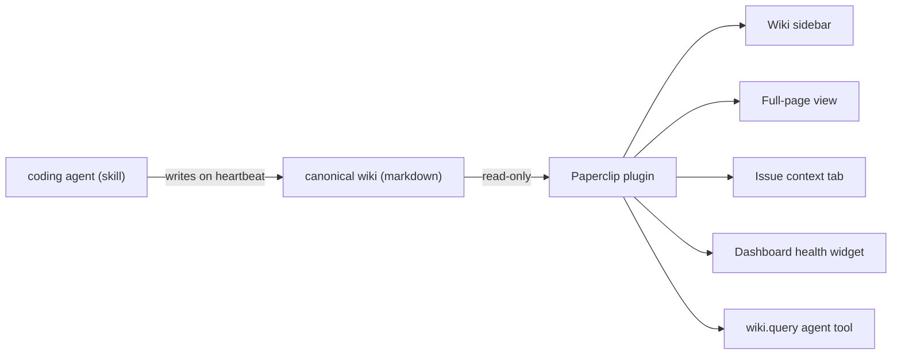

<!-- Adapted from: docs/integrations.html (source: README.md "Integrations", integrations/paperclip/**). -->

# Integrations

The skill is the agent-side install — every agent in the [support matrix](/agents) gets you that. For teams on [Paperclip](https://github.com/paperclipai/paperclip), an optional human-side companion brings the wiki into view where operators already work.

## Paperclip — `paperclip-plugin-llm-wiki`

An optional plugin at [`integrations/paperclip/plugin/`](https://github.com/praneybehl/llm-wiki-plugin/tree/main/integrations/paperclip/plugin) surfaces the wiki inside Paperclip's UI. Five surfaces, all read-only:

| Surface | What it does |
| --- | --- |
| Wiki sidebar | Browse the wiki by type, drill into pages, search across the whole wiki. |
| Full-page view | The same browser at full width — for reading multiple linked pages. |
| Issue context tab | Top wiki pages relevant to the open issue, ranked by BM25 over title + description. |
| Dashboard health widget | Page count, lint status (pass / warn / fail), link density, sharding-threshold messages. |
| `wiki.query` agent tool | BM25 search via tool call — for HTTP-only adapters that don't run the skill directly. |



Install (once v0.1 ships to npm):

```bash
pnpm paperclipai plugin install paperclip-plugin-llm-wiki
```

::: info
The plugin is **read-only by design** and pairs with the skill. The skill writes the wiki on heartbeat; the plugin reads it from inside Paperclip. Editing still happens through agents on heartbeat or the operator's editor of choice (Obsidian, Claude Code, direct SSH).
:::

::: info
The plugin stays lexical (BM25) — the Paperclip sandbox holds no API keys, so the opt-in hybrid embeddings described on the [Search & retrieval](/search) page apply to the agent-side scripts only. Section-level search in the plugin mirrors the Python ranking exactly, so results don't drift between the plugin and the agent.
:::

## Further reading

- [Plugin user guide](https://github.com/praneybehl/llm-wiki-plugin/blob/main/integrations/paperclip/plugin/README.md) — install walkthrough, per-surface usage, configuration reference, agent-tool JSON shape, security notes, troubleshooting, FAQ.
- [Operator decision page](https://github.com/praneybehl/llm-wiki-plugin/blob/main/integrations/paperclip/README.md) — when to install the plugin vs. just the skill, first-time setup, multi-Company guidance.
- [v0.1 design spec](https://github.com/praneybehl/llm-wiki-plugin/blob/main/integrations/paperclip/SPEC.md) — with verbatim references to the live Paperclip plugin SDK source.
- [Feasibility report](https://github.com/praneybehl/llm-wiki-plugin/blob/main/integrations/paperclip/FEASIBILITY.md) — Phase 0 validation against the SDK.
