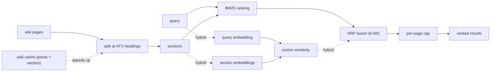

<!-- Adapted from: docs/search.html (source: v2 retrieval design — section search, --json, --cache, hybrid embeddings). -->

# Search & retrieval

v2.0.0 rebuilds the retrieval layer: search is section-level by default, emits structured `--json` evidence rows, keeps an incremental parse cache, and can fuse in optional semantic embeddings — all with pure stdlib Python, no install.

The search script is the fallback for when the index's one-line summaries don't surface good candidates (see the [query workflow](/workflows#query)). It runs from the repo root:

```bash
python skills/llm-wiki/scripts/wiki_search.py "attention mechanism" --wiki wiki --json
```



## Section-level results

By default (`--granularity section`), the script splits every page at its ATX headings and ranks the resulting sections with BM25, keeping at most `--per-page` sections per page (default 2) until `--top` results are collected. Each section is scored over its title, its heading path, and its text — a contextual-BM25 prefix that sharpens matches inside long pages.

Ranking constants are unchanged from v1 (BM25 with `k1=1.5`, `b=0.75`), and the Paperclip TypeScript port mirrors them exactly, so plugin and agent results stay in lockstep.

## JSON evidence rows

The `--json` flag emits one machine-readable object to stdout — ideal for feeding an agent or another tool:

```json
{
  "query": "attention mechanism",
  "wiki": "wiki",
  "granularity": "section",
  "mode": "lexical",
  "results": [
    {
      "slug": "attention-mechanism",
      "rel_path": "concepts/attention-mechanism.md",
      "type": "concept",
      "title": "Attention Mechanism",
      "heading_path": ["Attention Mechanism", "Variants"],
      "section_index": 2,
      "score": 8.42,
      "retrievers": ["bm25"],
      "snippet": "...",
      "updated": "2026-01-20",
      "tags": ["attention"],
      "sources": ["attention-paper"],
      "neighbors": {"prev": "Scaled dot-product", "next": "Cross-attention"}
    }
  ]
}
```

| Field | Meaning |
| --- | --- |
| `heading_path` | The heading stack for the matched section (ancestor headings ending with this one). Empty in page granularity. |
| `section_index` | The section's position within its page. `null` in page granularity. |
| `score` | The BM25 score (or RRF score in hybrid mode), rounded to 4 decimals. |
| `retrievers` | Which retrievers surfaced this row: `["bm25"]`, `["embedding"]`, or both. |
| `snippet` | The section text, whitespace collapsed, first 400 characters. |
| `updated`, `tags`, `sources` | Straight from frontmatter (`null` / `[]` when absent). |
| `neighbors` | The headings of the adjacent sections on the same page (`null` at page edges). |

Without `--json`, results print in the familiar human format, with a `§` line showing the heading path for section hits.

## Whole-page ranking

Pass `--granularity page` to rank whole pages exactly as v1 did — the pre-v2 behavior, byte-for-byte. Page-granularity rows carry an empty `heading_path` and a `null` `section_index`, and are always lexical (embeddings apply only to section granularity).

```bash
python skills/llm-wiki/scripts/wiki_search.py "attention mechanism" --wiki wiki --granularity page --json
```

## Filters

Narrow results with frontmatter filters, all combinable:

```bash
python skills/llm-wiki/scripts/wiki_search.py "diffusion" --wiki wiki \
  --type concept --tag generative --since 2026-01-01 --top 10 --per-page 3
```

Two link-oriented modes keep the v1 text output: `--backlinks <slug>` finds inbound links, and `--top-linked N` finds the wiki's hub pages.

## The parse cache

The `--cache` flag keeps an incremental parse cache so large wikis don't re-parse every page on every search. With no value it resolves to `wiki/.wiki-cache/search-index.json`; pass a path to override.

```bash
# Use the default cache location
python skills/llm-wiki/scripts/wiki_search.py "attention" --wiki wiki --json --cache

# Or an explicit path
python skills/llm-wiki/scripts/wiki_search.py "attention" --wiki wiki --json --cache /tmp/idx.json
```

Each file is keyed by the SHA-256 of its raw bytes: unchanged files are reused, changed files are reparsed, deleted files are dropped. A cache that is missing, unparseable, or from an older schema is rebuilt from scratch, with a single `cache: rebuilding (<reason>)` line to stderr. The cache is written atomically.

::: info Guaranteed identical results
`--json` output with and without `--cache` is byte-identical for the same query — the cache only changes speed, never ranking. This invariant is checked by the eval harness.
:::

## Optional hybrid embeddings

When an embedding endpoint is configured via environment variables, section search becomes *hybrid*: BM25 and semantic similarity are fused with Reciprocal Rank Fusion (RRF, `k=60`, equal weights). This closes the semantic gap where a paraphrased query shares no words with the target section. Configure with:

| Variable | Purpose |
| --- | --- |
| `LLM_WIKI_EMBED_URL` | The embeddings endpoint. Defaults to `https://api.openai.com/v1/embeddings` when `OPENAI_API_KEY` is set. |
| `LLM_WIKI_EMBED_KEY` | API key (falls back to `OPENAI_API_KEY`). Omit for keyless local endpoints. |
| `LLM_WIKI_EMBED_MODEL` | Model name. Defaults to `text-embedding-3-small`. |

Without any of these, search stays lexical BM25 — exactly as before. In hybrid mode, JSON `mode` becomes `"hybrid"` and each row's `retrievers` lists which retrievers found it. Section vectors are cached in `wiki/.wiki-cache/embeddings.jsonl`; only new or changed sections are embedded. Pass `--no-embed` to force lexical for one run.

::: warning Failures never break search
If the embedding backend errors, times out, or returns bad data, the command prints a warning to stderr, falls back to plain BM25, and exits 0 with `mode: "lexical"`. A hybrid search can degrade, but it cannot fail the command.
:::

### Worked config: OpenAI

```bash
export OPENAI_API_KEY=sk-your-key-here
python skills/llm-wiki/scripts/wiki_search.py "how does self-attention weigh tokens" \
  --wiki wiki --json --top 5
```

Uses `text-embedding-3-small` on `api.openai.com` by default. The first run embeds every section (one `embedding N new sections…` line to stderr); later runs only embed what changed.

### Worked config: local Ollama

```bash
export LLM_WIKI_EMBED_URL=http://localhost:11434/v1/embeddings
export LLM_WIKI_EMBED_MODEL=nomic-embed-text
python skills/llm-wiki/scripts/wiki_search.py "how does self-attention weigh tokens" \
  --wiki wiki --json --top 5
```

No key is needed for a local endpoint — leave `LLM_WIKI_EMBED_KEY` unset and no `Authorization` header is sent. The same pattern works for LM Studio or any other OpenAI-compatible server.

## The cache directory

`wiki/.wiki-cache/` holds every regenerable retrieval artifact — the parse cache and the embedding vectors. It is gitignored, safe to delete at any time (deleting it is the reset), and should never be edited by hand.
