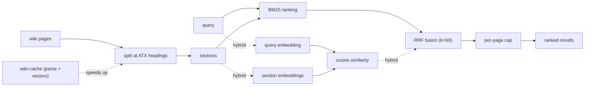

<!-- Source: v3 local hybrid design — FastEmbed, sqlite-vec, BM25/RRF, JSON evidence, and incremental caches. -->

# Search & retrieval

v3.0.0 makes section-level hybrid search local and default: FastEmbed produces semantic vectors, sqlite-vec stores and ranks them, BM25 preserves exact-term precision, and RRF fuses both result lists. Structured `--json` evidence rows and content-hashed incremental caches remain unchanged.

The search script is the fallback for when the index's one-line summaries don't surface good candidates (see the [query workflow](/workflows#query)). It runs from the repo root:

```bash
uv run --script skills/llm-wiki/scripts/wiki_search.py "attention mechanism" --wiki wiki --json
```



## Section-level results

By default (`--granularity section`), the script splits every page at its ATX headings and ranks the resulting sections with BM25, keeping at most `--per-page` sections per page (default 2) until `--top` results are collected. Each section is scored over its title, its heading path, and its text — a contextual-BM25 prefix that sharpens matches inside long pages.

Ranking constants are unchanged from v1 (BM25 with `k1=1.5`, `b=0.75`), and the Paperclip TypeScript port mirrors them exactly, so plugin and agent results stay in lockstep.

## JSON evidence rows

The `--json` flag emits one machine-readable object to stdout — ideal for feeding an agent or another tool:

```json
{
  "query": "attention mechanism",
  "wiki": "wiki",
  "granularity": "section",
  "mode": "lexical",
  "results": [
    {
      "slug": "attention-mechanism",
      "rel_path": "concepts/attention-mechanism.md",
      "type": "concept",
      "title": "Attention Mechanism",
      "heading_path": ["Attention Mechanism", "Variants"],
      "section_index": 2,
      "score": 8.42,
      "retrievers": ["bm25"],
      "snippet": "...",
      "updated": "2026-01-20",
      "tags": ["attention"],
      "sources": ["attention-paper"],
      "neighbors": {"prev": "Scaled dot-product", "next": "Cross-attention"}
    }
  ]
}
```

| Field | Meaning |
| --- | --- |
| `heading_path` | The heading stack for the matched section (ancestor headings ending with this one). Empty in page granularity. |
| `section_index` | The section's position within its page. `null` in page granularity. |
| `score` | The BM25 score (or RRF score in hybrid mode), rounded to 4 decimals. |
| `retrievers` | Which retrievers surfaced this row: `["bm25"]`, `["embedding"]`, or both. |
| `snippet` | The section text, whitespace collapsed, first 400 characters. |
| `updated`, `tags`, `sources` | Straight from frontmatter (`null` / `[]` when absent). |
| `neighbors` | The headings of the adjacent sections on the same page (`null` at page edges). |

Semantic candidates must also clear a conservative cosine-similarity floor before RRF. This prevents unrelated vector neighbors from turning out-of-domain questions into confident-looking results; exact BM25 matches remain unaffected.

Without `--json`, results print in the familiar human format, with a `§` line showing the heading path for section hits.

## Whole-page ranking

Pass `--granularity page` to rank whole pages exactly as v1 did — the pre-v2 behavior, byte-for-byte. Page-granularity rows carry an empty `heading_path` and a `null` `section_index`, and are always lexical (embeddings apply only to section granularity).

```bash
python skills/llm-wiki/scripts/wiki_search.py "attention mechanism" --wiki wiki --granularity page --no-embed --json
```

## Filters

Narrow results with frontmatter filters, all combinable:

```bash
uv run --script skills/llm-wiki/scripts/wiki_search.py "diffusion" --wiki wiki \
  --type concept --tag generative --since 2026-01-01 --top 10 --per-page 3
```

Two link-oriented modes keep the v1 text output: `--backlinks <slug>` finds inbound links, and `--top-linked N` finds the wiki's hub pages.

## The parse cache

The `--cache` flag keeps an incremental parse cache so large wikis don't re-parse every page on every search. With no value it resolves to `wiki/.wiki-cache/search-index.json`; pass a path to override.

```bash
# Use the default cache location
uv run --script skills/llm-wiki/scripts/wiki_search.py "attention" --wiki wiki --json --cache

# Or an explicit path
uv run --script skills/llm-wiki/scripts/wiki_search.py "attention" --wiki wiki --json --cache /tmp/idx.json
```

Each file is keyed by the SHA-256 of its raw bytes: unchanged files are reused, changed files are reparsed, deleted files are dropped. A cache that is missing, unparseable, or from an older schema is rebuilt from scratch, with a single `cache: rebuilding (<reason>)` line to stderr. The cache is written atomically.

::: info Guaranteed identical results
`--json` output with and without `--cache` is byte-identical for the same query — the cache only changes speed, never ranking. This invariant is checked by the eval harness.
:::

## Default local hybrid retrieval

Section search uses `BAAI/bge-small-en-v1.5` through FastEmbed and stores its 384-dimensional vectors in a sqlite-vec virtual table. BM25 and semantic ranks are fused with Reciprocal Rank Fusion (RRF, `k=60`, equal weights). No API key or service is involved, and wiki sections and query text never leave the machine.

The script carries pinned [PEP 723](https://peps.python.org/pep-0723/) dependencies. Run it with `uv` so those packages are available without modifying your project environment:

```bash
uv run --script skills/llm-wiki/scripts/wiki_search.py \
  "how does self-attention weigh tokens" --wiki wiki --json --top 5
```

Initialization and every upgrade run `setup_wiki.py`: FastEmbed model artifacts are cached under `~/.cache/llm-wiki/fastembed/` (override with `FASTEMBED_CACHE_PATH`), and every current section is synchronized into `wiki/.wiki-cache/embeddings.sqlite`. Subsequent searches and upgrades embed only new or changed sections and remove deleted ones.

In hybrid mode JSON `mode` is `"hybrid"` and every row's `retrievers` field shows whether BM25, embeddings, or both surfaced it.

::: warning Failures never break search
If FastEmbed is unavailable, model initialization fails, or sqlite-vec cannot load, the command emits a non-sensitive warning to stderr, falls back to BM25, and exits 0 with `mode: "lexical"`. To choose the dependency-free path explicitly, bypass PEP 723 resolution: `python skills/llm-wiki/scripts/wiki_search.py "<query>" --no-embed`.
:::

## The cache directory

`wiki/.wiki-cache/` contains two independent, fully regenerable indexes:

| File | Purpose |
| --- | --- |
| `search-index.json` | Parsed page/section cache used by `--cache`. |
| `embeddings.sqlite` | Section locators, content hashes, and sqlite-vec vectors. |

Both are gitignored and safe to delete. The next query rebuilds what is missing. A model, dimension, or vector-schema change also rebuilds `embeddings.sqlite` automatically. Legacy `embeddings.jsonl` provider caches are ignored and may be removed.
