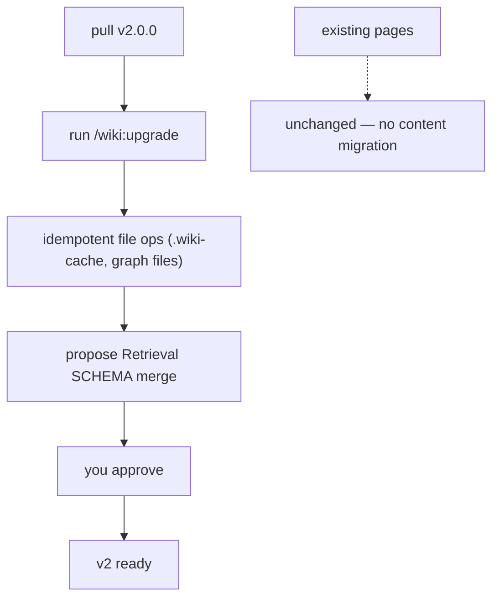

<!-- Adapted from: docs/upgrade.html (source: v2.0.0 upgrade path, commands/wiki/upgrade.md). -->

# Upgrade to v2.0.0

v2.0.0 rebuilds retrieval (section-level search, JSON evidence, a real cache, opt-in embeddings). Upgrading an existing wiki is three steps — and touches none of your pages.

::: info No content migration
No page or frontmatter format changed in v2. Everything new is a regenerable cache under `wiki/.wiki-cache/`. Your existing pages are already valid v2 pages — there is nothing to rewrite.
:::



## Why it's a major version

The breaking change is small and opt-outable: the default search granularity moves from whole-page to section, and the human search output gains a `§` line showing the matched heading path. If a downstream tool parses the old page-level output, `--granularity page` restores the previous behavior byte-for-byte.

## The upgrade

1. **Pull v2.0.0.** Update the plugin the same way you installed it — for Claude Code, re-run the marketplace install; for skill-only agents, re-run `npx skills add`.
2. **Run the upgrade.** In Claude Code:

   ```bash
   /wiki:upgrade
   ```

   Or directly, from the plugin's skill directory (add `--wiki-dir` / `--raw-dir` if you use non-default names):

   ```bash
   python skills/llm-wiki/scripts/init_wiki.py . --upgrade
   ```

   > **Expected** — Idempotent file operations: creates `wiki/.wiki-cache/.gitignore` and any missing graph-layer files, without touching anything that already exists. Then it prints the missing SCHEMA.md sections, including:
   >
   > `[2.0.0] Retrieval (section search, cache, optional embeddings)`
3. **Approve the SCHEMA.md merge.** The upgrade proposes appending one new `## Retrieval` section to your `wiki/SCHEMA.md`, shown for your approval before anything is written. SCHEMA.md is co-evolved with you — it is never modified silently. Approve it (or hand-merge if you've customized that area).

Re-running the upgrade is a no-op: files that exist are left alone, and an already-merged SCHEMA.md reports no missing sections.

## What changes for you

- **Existing pages need no changes.** Nothing in `wiki/` is rewritten.
- **Search is section-level by default** and can emit `--json` evidence rows. Use `--granularity page` for the old whole-page ranking. See [Search & retrieval](/search).
- **Embeddings are opt-in** via `LLM_WIKI_EMBED_URL` / `LLM_WIKI_EMBED_KEY` / `LLM_WIKI_EMBED_MODEL` (or `OPENAI_API_KEY` for api.openai.com). Without them, search stays lexical BM25.
- **`wiki/.wiki-cache/` is regenerable** — it holds the parse cache and embedding vectors, is gitignored, and is safe to delete at any time.
- **The `## Retrieval` SCHEMA section** is merged like the graph sections were — walked, shown, approved.

::: warning
No wiki yet? There's nothing to upgrade — run [`/wiki:init`](/getting-started) instead.
:::
