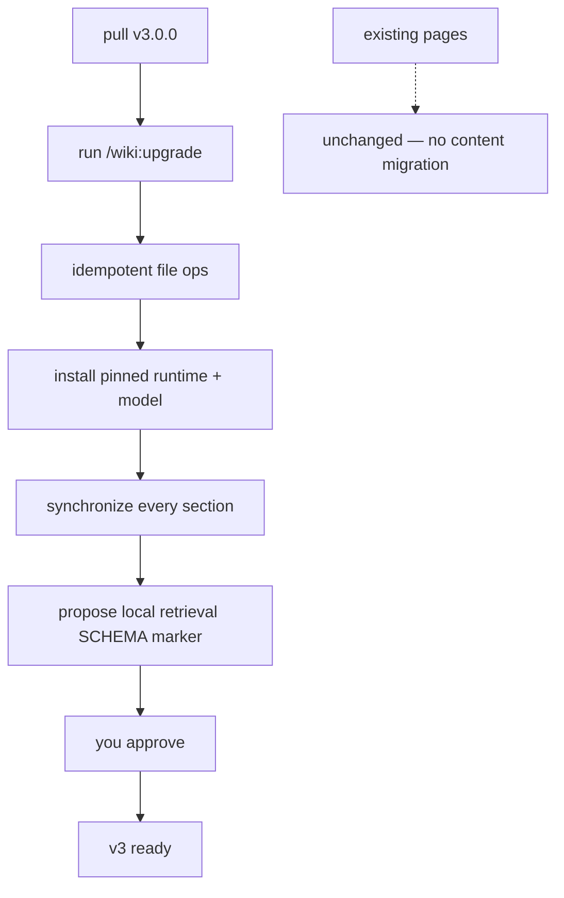

<!-- Adapted from: the v3.0.0 local semantic retrieval design and commands/wiki/upgrade.md. -->

# Upgrade to v3.0.0

v3.0.0 replaces provider-backed embeddings with default local FastEmbed + sqlite-vec retrieval. Existing Markdown stays untouched; only the disposable vector index changes.

::: info No content migration
No page or frontmatter format changed. The old `embeddings.jsonl` cache is ignored and can be deleted; `/wiki:upgrade` builds `embeddings.sqlite` locally and synchronizes every current section.
:::



## Why it's a major version

The default section search now initializes a local model and sqlite-vec index instead of staying lexical unless a provider is configured. The data boundary becomes strictly local and the old provider environment variables and approval flag are removed. Direct `python wiki_search.py "<query>" --no-embed` preserves dependency-free BM25.

## The upgrade

1. **Pull v3.0.0.** Update the plugin the same way you installed it — for Claude Code, re-run the marketplace install; for skill-only agents, re-run `npx skills add`.
2. **Run the upgrade.** In Claude Code:

   ```bash
   /wiki:upgrade
   ```

   Or directly, from the plugin's skill directory (add `--wiki-dir` / `--raw-dir` if you use non-default names):

   ```bash
   python skills/llm-wiki/scripts/init_wiki.py . --upgrade
   ```

   > **Expected** — Idempotent file operations leave existing pages untouched. Runtime setup then reports `"status": "ready"` with pinned dependency versions, model, page count, section count, and vector-index path before the command reports the missing SCHEMA marker.
3. **Approve the SCHEMA.md merge.** Add the local semantic backend lines from the current template to your existing `## Retrieval` section. SCHEMA.md is co-evolved with you and is never modified silently.

Re-running the upgrade is idempotent: existing content stays unchanged, dependencies/model are verified, and only changed or missing vectors are embedded.

## What changes for you

- **Existing pages need no changes.** Nothing canonical under `wiki/` is rewritten.
- **Section search is local hybrid by default.** FastEmbed + sqlite-vec semantic ranking is fused with BM25. Run the script directly with Python and `--no-embed` for dependency-free lexical retrieval, or use `--granularity page` for whole-page ranking.
- **Upgrade installs everything.** The command resolves pinned FastEmbed, sqlite-vec, and PyYAML packages through `uv`, downloads the pinned model if absent, builds the parse cache, and embeds all current sections.
- **`wiki/.wiki-cache/` is regenerable.** `search-index.json` and `embeddings.sqlite` are gitignored and safe to delete. Legacy `embeddings.jsonl` is ignored.
- **No provider setup remains.** No API key, endpoint, data-transfer approval, or per-query charge is involved.

::: warning
No wiki yet? There's nothing to upgrade — run [`/wiki:init`](/getting-started) instead.
:::
