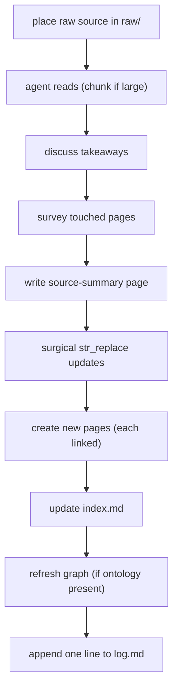
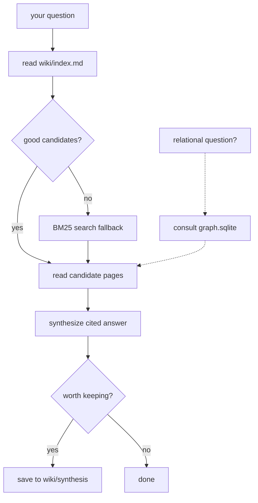

<!-- Adapted from: docs/workflows.html (source: skills/llm-wiki/references/{ingest-workflow,query-workflow,lint-workflow}.md). -->

# Workflows

The wiki has three operations: [ingest](#ingest) a source, [query](#query) the accumulated knowledge, and [lint](#lint) for health. Here is what happens in each, from your point of view.

::: info
You drive these by command (`/wiki:ingest`, `/wiki:query`, `/wiki:lint`) or by natural language. The agent does the bookkeeping; your job is to curate sources, answer a few questions, and approve edits.
:::

## Ingest a source {#ingest}

When a new source arrives, this is the procedure. The order matters — each step builds context for the next.



1. **Place the raw source.** Drop the file into `raw/` with a descriptive, slugified filename (lowercase, hyphens, original extension). Web articles as `.md`, PDFs as `.pdf`, transcripts as `.md` or `.txt`. This slug becomes the slug of the source-summary page.
2. **The agent reads it.** Short sources are read in one pass; long ones (papers over ~30 pages, book chapters, multi-hour transcripts) are chunk-read section by section so the wiki never blows out the context window.
3. **Discuss the takeaways.** The agent surfaces what stood out, what was surprising, and what connects to existing pages — three or four sentences. Your reaction shapes the edits ("skip the methodology, only the results matter", "this contradicts the page on X, flag it"). In hands-off batch mode this step is skipped and edits stay conservative.
4. **The agent surveys what's touched.** It reads the index and the candidate pages to build a list of pages to update, new pages to create, and contradictions to flag. This survey is what prevents duplicate pages.
5. **The source-summary page is written** to `wiki/sources/` — the key claims, methodology, conclusions, and open questions, ending with a "Where this fits" section of `[[wikilinks]]`. It is a summary, not a re-paraphrase of the whole source.
6. **Touched pages are updated surgically** with `str_replace`, not full rewrites. Corroborations add a citation; contradictions get a prominent "Contradictions" note with both sources cited (never a silent overwrite).
7. **New pages are created** for new entities and concepts that warrant one — each with frontmatter, a body, and at least one inbound link. A page nothing links to is treated as a bug, not just a lint finding.
8. **The index is updated** with a one-line entry per new page. If `index.md` crosses 300 lines, that's the signal to shard — see the [scaling thresholds](/commands#stats).
9. **The graph layer is refreshed** only if `wiki/graph/ontology.yaml` exists and the source explicitly supports typed edges. See the [Graph layer guide](/graph).
10. **The log gets one line** and the agent tells you what it did: pages touched, pages created, contradictions flagged, follow-ups worth investigating.

## Query the wiki {#query}

The job is to answer your question from the wiki, with citations, and to file the answer back as a synthesis page when it's worth keeping.



1. **The index is read first.** Always start at `wiki/index.md` (or the relevant shard). One line per page with a tight summary is usually enough to spot candidates.
2. **Candidate pages are identified.** A short, selective list—reading 30 pages to answer one question is brute force. If index summaries do not disambiguate, the agent runs local hybrid search:

   ```bash
   uv run --script skills/llm-wiki/scripts/wiki_search.py \
     "your query terms" --top 10 --json
   ```

   FastEmbed semantic ranking and BM25 are fused locally. Add `--type concept`, `--tag <tag>`, or `--since YYYY-MM-DD` to narrow. For dependency-free lexical retrieval, run `python skills/llm-wiki/scripts/wiki_search.py "your query terms" --no-embed` instead of the `uv run --script` form. Full detail: [Search & retrieval](/search).
3. **Relational questions consult the graph** ("what's connected to X", "who proposed Y", "trace the path A → B") when `graph.sqlite` exists — used to pick which pages to read, never as the sole evidence.
4. **Candidate pages are read** in full, following the most promising `[[wikilinks]]` without recursively chasing every one.
5. **Backlinks are found when useful** — for "where is X mentioned" the inbound links are often more interesting than the page itself:

   ```bash
   python skills/llm-wiki/scripts/wiki_search.py "" --backlinks <slug>
   ```
6. **The answer is synthesized** in the agent's own words with `[[wikilink]]` citations. Contradictions are surfaced explicitly rather than resolved by picking a side. If the wiki has nothing relevant, it says so plainly and suggests sources to ingest — it does not confabulate.
7. **You're offered a file-back.** When the answer makes new connections, the agent offers to save it to `wiki/synthesis/` so the next adjacent question benefits. Decline for trivial lookups.

## Lint for health {#lint}

A periodic health check — best run on a cadence, not on every operation. It splits into a structural pass (a script) and a semantic pass (the agent reading pages).

1. **Run the structural lint.**

   ```bash
   python skills/llm-wiki/scripts/wiki_lint.py wiki/
   ```

   This reports orphan pages, broken wikilinks, oversized pages, frontmatter issues, stale pages, and duplicate slugs. If the graph layer exists, `wiki_graph_lint.py` runs too.
2. **Triage the findings with the agent.** Each finding comes with a proposed fix — link an orphan from a sensible parent, repair or remove a broken link, split an oversized page, add missing frontmatter, refresh a stale page, merge a duplicate slug. You approve each fix; nothing is applied silently.
3. **The semantic pass reads pages.** The agent reads the ~10 most recently updated pages and the most-linked hub pages, looking for contradictions with older pages, internal inconsistencies, and concepts mentioned everywhere but lacking their own page. Find hubs with:

   ```bash
   python skills/llm-wiki/scripts/wiki_search.py "" --top-linked 10
   ```
4. **Gaps are surfaced.** Names that appear in many pages but have no page of their own are candidates for promotion:

   ```bash
   python skills/llm-wiki/scripts/wiki_lint.py wiki/ --suggest-pages
   ```
5. **The index is updated** for any pages that were added, renamed, or deleted, and one summary line is appended to `log.md`.

::: info Cadence
A reasonable default: structural lint after every 5 ingests, semantic lint weekly or every 20 ingests, gap-finding monthly. If the lint report grows faster than you can triage, that's a signal to lint more often or revise the schema.
:::
