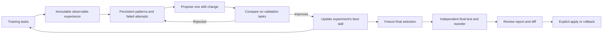

# Learning and skill evolution

The optional evolution loop learns from observable task outcomes, consolidates patterns in your wiki, proposes changes to one complete skill, and selects improvements using validation. It freezes the selected skill before running an independent final test. Your installed skill changes only when you apply the resulting proposal.



## Run the complete cycle

Use `/wiki:evolve` or ask your agent to run skill evolution. Resolve the factual corpus, learning wiki, raw root, and target skill separately. Use a working skill copy; an absent target directory starts with no skill and lets the proposer create one. Read the wiki's schema before writing knowledge pages.

Copy `eval/evolution/pilot/config.example.json` from the plugin repository and replace the adapter path and exact model IDs. Each role has its own runner and model: inference executes tasks, maintainer consolidates experience, proposer changes the skill, and judge verifies answers. Configure an authorized run budget before launching inference.

```bash
python <skill-root>/scripts/wiki_evolve_loop.py \
  --wiki /path/to/learning-wiki --raw /path/to/raw \
  --id query-cycle-01 --skill /path/to/working-skill \
  --suite /path/to/suite-v2.json --config /path/to/config.json
```

The loop runs a bounded number of iterations. Every iteration captures training tool events, answers, artifacts and verification; updates reusable patterns; reads previous attempts; proposes a coherent multi-file change; and compares it with the current best on repeated validation tasks. Strictly better validation performance is required. Optional cost/tool ratios and critical-task regression checks can further restrict selection. Rejected changes and their rationale remain available to subsequent proposals, while duplicate rejected candidates against the same baseline are skipped.

After all iterations, selection is frozen. The baseline and selected skill run on final-test tasks. Those results are reported, never sent back to the maintainer or proposer, and do not select another candidate. Optional `transfer` entries run that same frozen comparison through other agent/model combinations using the same judge and budget. A poor final result is a reason to withhold adoption; it is not permission to optimize against those exposed tests. Use fresh test tasks for a later study. The learning wiki records consumed test fingerprints and rejects reuse in subsequent optimization runs.

A successful run with a selected improvement creates `<run-id>-selected`, compatible with the existing review/apply commands:

```bash
python <skill-root>/scripts/wiki_evolve.py --wiki /path/to/learning-wiki show query-cycle-01-selected
python <skill-root>/scripts/wiki_evolve.py --wiki /path/to/learning-wiki apply query-cycle-01-selected
python <skill-root>/scripts/wiki_evolve.py --wiki /path/to/learning-wiki rollback query-cycle-01-selected
```

`wiki_evolve.py history` and `show <run-id>` also expose complete loop runs and their retained decisions. A completed run can select no change. A runtime failure or exhausted budget never creates an apply-ready proposal. Interrupted runs preserve evidence but cannot resume under the same ID after exposing evaluation inputs.

## Tasks and verification

Version 2 suites require separate `train`, `validation` and `test` tasks and positive/negative judge calibration cases. Every task has a question, semantic rubric, expected abstention and source paths. Calibration runs before training and must pass. Include correct paraphrases, wrong numerical answers, contradictions and plausible unsupported additions when calibrating your own judge.

The inference runner receives only the task, factual wiki, write permissions and complete skill content. It receives no rubric, split, expected answer, variant label or learning history. The adapter injects the complete skill and returns its hash; this verifies provisioning, not that the model obeyed every instruction. The prompt supplies execution boundaries and output format, without teaching the target procedure.

The independent judge sees the question, rubric, answer and source text, without the skill or variant identity. It checks meaning and source support and returns a verdict with exact source quotations. The harness verifies those quotations exist, validates citations and abstention, and checks requested artifacts. This reduces keyword-matching errors; a calibrated model judge can still make mistakes. Review material failures and report sample size, models and repeated results alongside any claimed benefit.

Task output paths are relative to the supplied wiki root. Tasks may declare `allow_write` patterns and exact `artifacts` checks (`text`, parsed `json`, or `absent`). This supports ingestion, editing and generated outputs in fresh workspace copies. Undeclared changes fail the run. Original source files remain protected unless explicitly permitted by the task. Bash-capable adapters can exercise existing search scripts, including hybrid search when the copied skill and runtime dependencies are present.

The repository fixture `eval/evolution/pilot/suite-v2.json` contains 23 fictional Lark tasks, including artifact creation. It is a public demonstration, not representative project knowledge or evidence of generalization. Replace it with a representative private corpus and independent tasks before making product decisions. Existing retrieval benchmarks remain separate.

## Agent adapters and budgets

The shared adapter supports installed, authenticated Claude Code and Codex CLIs:

```json
{"argv":["python3","/absolute/skill/scripts/wiki_evolve_agent.py","codex"],"model":"EXACT_MODEL_ID"}
```

Use `claude` as the final argument for Claude Code. Both handle all four roles, structured results, observable tool events and token usage. Claude reports inference USD; Codex CLI supplies tokens but no measured USD, so its cost is `null`, never a fabricated zero. The old `wiki_evolve_claude.py` entry point remains compatible and now uses the neutral shared adapter. Other agents can implement the same stdin/stdout JSON contract.

One ledger counts inference, maintainer, proposer, judge calibration, validation, final testing and transfer calls. `max_calls` prevents further runner launches, `max_seconds` limits total runtime, and `timeout` limits each process group. Claude receives the remaining `max_usd` as its native budget limit. A USD-limited run fails closed if a runner cannot report cost or exceeds the limit. Codex requires `max_usd: null` and explicit call/time limits, suitable for an authorized subscription trial. A provider may bill an in-flight request beyond its CLI threshold; this is not an exact prepaid spending guarantee. Set account-side spending controls when a strict financial ceiling is required.

The adapters reduce ambient instructions and use native restricted/sandbox modes. Host-managed policy can still apply. Workspace copies, hashes and write checks are not a security sandbox for an arbitrary executable; runners are trusted local code. External model calls transmit the supplied context to the selected provider. Keep private sources, captures and credentials out of published fixtures.

## Evidence, storage and recovery

Raw training observations are saved immutably under `raw/experiences/`. Source and concept pages, index links and log entries connect observed outcomes to persistent patterns. `.evolution/learning.json` retains consolidation and proposal history across runs. The proposer receives that training history, not final-test reports. `PURPOSE.md` travels with the selected skill and records the reasoning, pattern boundaries and originating run/task evidence.

Each run archive contains frozen configuration/corpus and evolution runtime scripts with hashes, observable call records, rollout artifacts, candidate snapshots, iteration decisions, selection and final results. Back up `.evolution/`; it is durable evidence, unlike `.wiki-cache/`. Ordinary search, lint, stats, graph tools and the Paperclip reader exclude this archive. Searchable lessons stay in normal wiki pages.

Apply and rollback support additions, edits and deletions across one skill. They check the entire installed skill and refuse concurrent edits. A transition journal permits recovery from an interrupted multi-file write; the operation is recoverable, not atomic to unrelated readers. Stop concurrent use of the target skill during transition. Rerun the same apply or rollback after interruption. Inspect stale wiki and skill locks before removing an empty lock left by a dead process. Never edit evidence or snapshots to force a passing result.

## Manual experience and proposals

`/wiki:learn` captures completed work without launching an optimizer. Use the installed `.experience-template.json` and `.pattern-template.md`, preserve verifiable successes and failures, ingest source evidence, and consolidate existing patterns before creating new ones.

For a manual whole-skill proposal, pass a candidate directory. For a single existing file, retain `--target`:

```bash
python <skill-root>/scripts/wiki_evolve.py --wiki /path/to/wiki propose \
  --id query-manual-01 --skill /path/to/working-skill \
  --candidate /path/to/candidate-skill --evidence concepts/query-pattern.md \
  --reason "Address the verified failure"
```

The legacy `wiki_evolve.py evaluate` command and version 1 `suite.json` remain available as deterministic regression checks. Both its validation and historically named “holdout” sets participate in its gate; neither is an independent final test. Use the version 2 loop for optimization and generalization measurement.

The design adapts the experience/wiki/skill layers and validation-driven evolution in [WikiSkill](https://arxiv.org/html/2608.27454v1). It does not claim to reproduce the paper's benchmark results. Version 3.2.0 is additive under this project's SemVer policy; existing wikis can continue unchanged or use `/wiki:upgrade` to add optional templates. Applying a skill proposal does not publish a plugin release.
